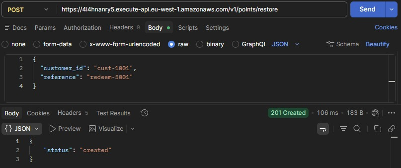
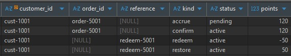
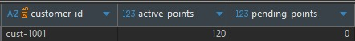

# Treuepunkte Service

## IHK Version

This repository also includes a version of the README adapted for IHK project requirements.

See [README_IHK.md](./README_IHK.md)

---

## 1. Project Overview

The Treuepunkte Service is a backend system for managing customer loyalty points in an e-commerce context.

The system enables the accrual, confirmation, and processing of bonus points that customers earn through orders. In addition, it supports the handling of point redemptions, cancellations, and restorations.

The application is designed as a serverless architecture using AWS Lambda and utilizes a relational database hosted on Amazon RDS (MariaDB) for persistent storage of transactions.

---

## 2. System Objective

The objective of the Treuepunkte Service is to provide reliable management of loyalty points for customers in an e-commerce system.

The system ensures that all point transactions are processed in a traceable, consistent, and idempotent manner. This prevents incorrect point balances caused by duplicate requests or technical errors.

Another key focus is the separation of business logic from technical implementation in order to achieve a maintainable and extensible architecture.

The system is designed to be horizontally scalable and suitable for cloud-native environments.

By using an event-based ledger approach, every change is stored as an individual transaction, ensuring a complete history of all point movements.

---

## 3. Features

The service provides the following core functionalities:

- Accrual of points (accrue)
- Confirmation of points (confirm)
- Revocation of points (revoke)
- Redemption of points (redeem)
- Restoration of points (restore)

Additionally, the system offers:

- Retrieval of a customer’s current point balance
- Access to the complete transaction history
- A health-check endpoint for system monitoring

---

## 4. Architecture / Technical Design

The Treuepunkte Service follows a layered architecture and is implemented as a serverless application using AWS services.

The system is stateless, with all persistent data stored in the database, enabling horizontal scalability.

### Components

The system consists of the following main components:

- **AWS Lambda**  
  Handles incoming HTTP requests and executes the business logic.

- **Amazon API Gateway**  
  Provides the REST interface and routes incoming requests to the Lambda function.

- **Amazon RDS (MariaDB)**  
  Stores all transactional data, including customer balances and the points ledger.


### Internal Structure

The application is structured into multiple layers to ensure separation of concerns:

- **HTTP Layer**  
  Responsible for request handling, routing, and response formatting.

- **Service Layer**  
  Contains the business logic and enforces domain rules.

- **Storage Layer**  
  Handles all database interactions and ensures transactional consistency.

- **Domain Layer**  
  Defines core models, constants, and business rules.


### Data Model Concept

The system is based on an **event-driven ledger approach**.

Instead of modifying existing records, every operation creates a new entry in the points ledger. This ensures:

- Full traceability of all point transactions  
- No loss of historical data  
- Easier debugging and auditing  

To optimize performance, a separate **balances table** is maintained, which stores the current point balance per customer.

This approach avoids direct state mutation and ensures that all changes are represented as explicit events.


### Idempotency

To prevent duplicate processing of requests, the system implements **idempotency** using an idempotency key.

If the same request is sent multiple times, it will only be processed once, ensuring data consistency and preventing incorrect point calculations.

This ensures that the system remains consistent even in distributed environments where retries may occur.

---

## 5. Technologies

The Treuepunkte Service is built using the following technologies:

- **Go (Golang)**  
  Used for implementing the backend logic and HTTP handling.

- **AWS Lambda**  
  Executes the application logic in a serverless environment.

- **Amazon API Gateway**  
  Exposes RESTful endpoints and routes incoming requests.

- **Amazon RDS (MariaDB)**  
  Provides persistent storage for customer data and transactions.

- **AWS SAM (Serverless Application Model)**  
  Used for building and deploying the serverless application.

- **Docker**  
  Used for local development and testing of the database.

- **Git & GitHub**  
  Used for version control and source code management.

- **Postman / curl**  
  Used for testing and validating API endpoints.

---

## 6. Project Structure

The project is organized into a clear and modular structure:

```text
.
├── Makefile
├── README.md
├── README_IHK.md
├── .gitignore
├── docs/
│   └── images/
│       ├── postman_restore.png
│       ├── points_ledger.png
│       └── balances.png
├── events/
│   └── event.json
├── samconfig.toml
├── sql/
│   └── init/
│       └── 001_schema.sql
├── template.yaml
└── treuepunkte-function/
    ├── integrationtests/
    ├── internal/
    ├── go.mod
    ├── go.sum
    └── main.go

    
### Description

- **Makefile**  
  Provides commands for building and deploying the application.

- **template.yaml**  
  Defines the AWS SAM configuration, including Lambda and API Gateway setup.

- **samconfig.toml**  
  Stores deployment configuration for AWS SAM.

- **events/**  
  Contains sample event payloads for local testing.

- **sql/**  
  Includes database initialization scripts.

- **treuepunkte-function/**  
  Main application source code:
  
  - **main.go**  
    Entry point for the AWS Lambda function
  
  - **internal/**  
    Contains the core application logic, structured into layers:
    - HTTP (handlers and routing)
    - Service (business logic)
    - Storage (database access)
    - Domain (models and rules)

  - **integrationtests/**  
    Contains integration tests for validating API behavior

  - **go.mod / go.sum**  
    Manage Go dependencies

---

## 7. API Endpoints

The service exposes the following REST endpoints:

| Method | Endpoint | Description |
|--------|----------|-------------|
| GET | `/health` | Checks whether the service is running |
| POST | `/v1/points/accrue` | Creates a pending points transaction for an order |
| POST | `/v1/points/confirm` | Confirms previously accrued points and moves them to the active balance |
| POST | `/v1/points/revoke` | Revokes points for a cancelled or returned order |
| POST | `/v1/points/redeem` | Redeems active points from a customer account |
| POST | `/v1/points/restore` | Restores previously redeemed points |
| GET | `/v1/customers/{customer_id}/balance` | Returns the current point balance of a customer |
| GET | `/v1/customers/{customer_id}/transactions` | Returns the full transaction history of a customer |

The write endpoints are designed to process loyalty point transactions in a consistent and idempotent way. Read endpoints provide access to the current balance and the complete transaction history of a customer.

---

## 8. Configuration

The application is configured using environment variables, which are defined in the AWS SAM template or provided at runtime.

### Environment Variables

| Variable | Description | Example |
|----------|------------|---------|
| `APP_ENV` | Application environment (e.g., dev, prod) | `dev` |
| `APP_PORT` | Port for local execution | `8080` |
| `DB_HOST` | Database host (RDS endpoint) | `treuepunkte-db.<region>.rds.amazonaws.com` |
| `DB_PORT` | Database port | `3306` |
| `DB_USER` | Database username | `treuepunkteuser` |
| `DB_PASS` | Database password | *(provided securely, not stored in code)* |
| `DB_NAME` | Database name | `treuepunkteDB` |


### Notes

- Sensitive data such as database passwords must **not be stored in the source code**.
- In production environments, secrets are managed using AWS Secrets Manager.
- The database password is stored as a secret and injected into the Lambda function via a CloudFormation dynamic reference.
- The application continues to read the password from the `DB_PASS` environment variable, without requiring changes to the business logic.
- For local development, environment variables can be set manually or via a `.env` file (which is excluded from version control).


### Secrets Management Implementation

The database password is stored in AWS Secrets Manager under the following name:

`treuepunkte/dev/db/password`

The secret is referenced in the SAM template using a dynamic reference:

```yaml
DB_PASS: "{{resolve:secretsmanager:treuepunkte/dev/db/password}}"
```
This ensures that sensitive data is not stored in the source code or repository.

The value is resolved during deployment and provided to the Lambda function as an environment variable.

Successful database interaction (e.g., POST `/v1/points/accrue` returning `{"status":"created"}`) confirms that the secret is correctly retrieved and used at runtime.

---

## 9. Running the Application / Deployment

### Prerequisites

Make sure the following tools are installed:

- **AWS CLI** (configured with appropriate permissions)
- **AWS SAM CLI**
- **Docker** (for local testing)
- **Go** (for development)


### Local Development

To run the service locally using AWS SAM:
```bash
sam build
sam local start-api
```

The API will be available at:

http://localhost:3000


### Deployment

To deploy the application to AWS:
```bash
sam deploy --guided
```

During the deployment process, you will be prompted to configure:

- Stack name
- AWS region
- IAM role permissions
- Environment variables

After deployment, the API Gateway endpoint URL will be displayed in the output.


### Notes

- Make sure that valid database credentials are provided via environment variables before deployment.
- After changes to configuration or infrastructure, a new `sam build` and `sam deploy` must be executed.

---

## 10. Testing

The system was tested on multiple levels to ensure correct behavior, data consistency, and reliability.

### Unit tests

A basic unit test was implemented to validate core business logic independently of the database.

It focuses on input validation and error handling in the service layer.

It can be executed with:

```bash
go test ./...
```

### Integration tests

Integration tests are located in the `integrationtests/` directory.

They validate the behavior of the API endpoints and the interaction between:

- HTTP layer
- service layer
- database

Covered use cases include:

- accrual and confirmation of points
- redemption and restoration of points
- validation of business rules
- API response behavior

### Local end-to-end testing

The application was tested locally using AWS SAM:

```bash
sam local start-api
```

HTTP requests were executed against the local API, and the database state was verified after each operation.

This ensured that:

- transactions are correctly written to the ledger
- balances are updated correctly
- full business flows behave as expected

### AWS environment testing

After deployment, the system was tested in a real AWS environment using:

- AWS Lambda
- API Gateway
- Amazon RDS

All endpoints were verified:

- write operations (accrue, confirm, redeem, restore, revoke)
- read operations (balance, transactions)

This confirmed correct interaction between the application and the database in a cloud environment.

### Idempotency and error scenarios

Additional tests were performed to validate system robustness.

Tested scenarios include:

- duplicate requests do not create duplicate ledger entries
- insufficient points cannot be redeemed
- confirm without prior accrue is rejected
- restore without previous redeem is rejected

These tests ensure that the system handles edge cases correctly and maintains consistent data.

Overall, the testing approach ensures that the system behaves correctly across different environments and scenarios.

---

## 11. Example Flow

The following example demonstrates a complete end-to-end loyalty points workflow in the deployed AWS environment.

A customer receives points for an order, the points are confirmed, part of the balance is redeemed, and later restored again.  
This illustrates the event-based ledger model and the resulting balance updates.

### API Request / Response



### points_ledger (SQL Table)



### balances (SQL Table)



---

## 12. Future Improvements

The following improvements can be considered for future development:

- Implementation of automatic secret rotation for database credentials using AWS Secrets Manager  
- Implementation of structured logging and monitoring  
- Addition of unit tests for all service layers  
- Improved error handling and validation mechanisms  
- CI/CD pipeline for automated build and deployment  


